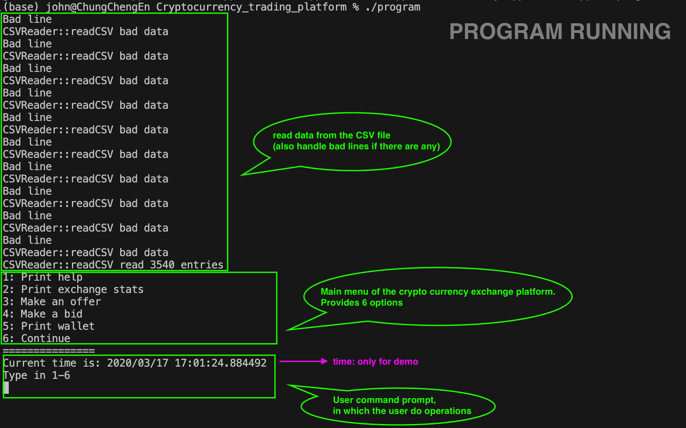
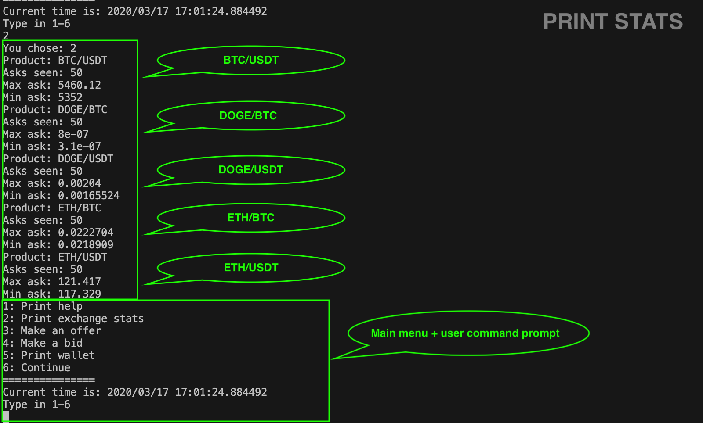
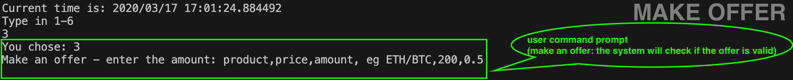
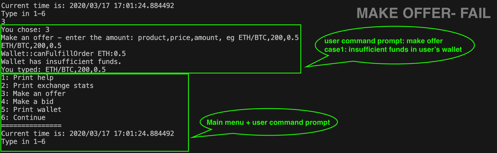
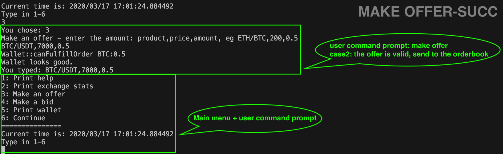
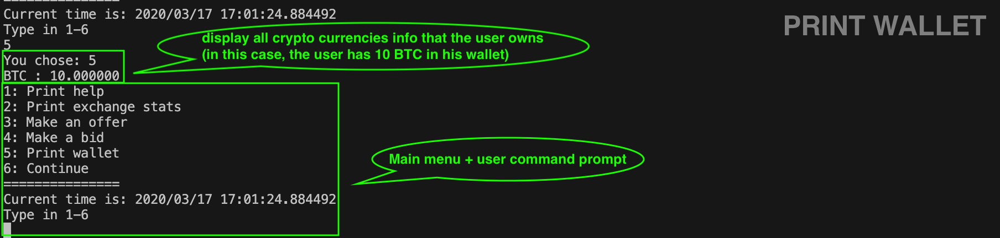
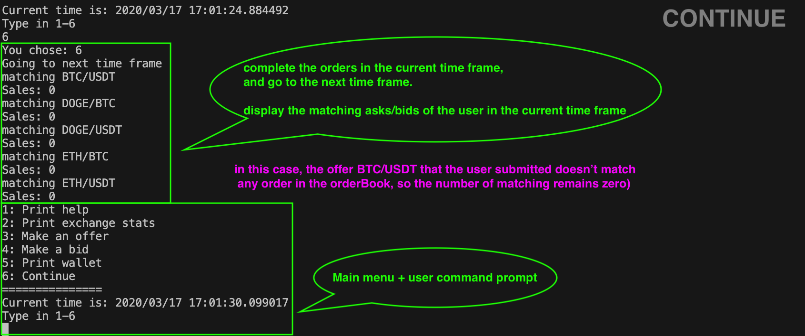

**Run the program**

> 1. run the following command, we'll get the executable file: `program`
```csh
make 
```

> 2. run the crypto currency platform by the following command

```csh
./program
```

> 3. to delete the executables, run the following command
```csh
make clear
```


**Crypto Currency Platform Guide**

1. **Starting the program**: 

   > The program read data from a CSV file (demo purpose), it also supports handling bad formatted lines.

   

2. **Option 2: Print Statistics**

   > Display the statistics of supported trading pairs: **Max ask** and **min ask** 
   > The supported trading pairs are:
   >
   > 1. `BTC/USDT`
   > 2. `DOGE/BTC`
   > 3. `DOGE/USDT`
   > 4. `ETH/BTC`
   > 5. `ETH/USDT`

   

3. **Option 3: Make an Offer** 

   > Make an offer of one of the supported trading pairs in the given format: 
   >
   > e.g. `ETH/BTC,200,0.5` 
   >
   > The system will check if the offer is valid.

   

   

   1. **Make an Offer- FAILURE**

      > If it fails, it means that the user doesn't have enough funds in his/hers wallet.

      

      

   2. **Make an Offer- SUCCESSFUL** 

      > If it succeeds, the offer will be sent to the orderBook for future crypto currency exchange.

      

   

4. **Option 4: Make a Bid**

   > It is the same as **option 3: Make an Offer** 

   

5. **Option 5: Print Wallet** 

   > Display all crypto currencies information of the user.

   

   

6. **Option 6: Continue** 

   > Complete all orders in the current time frame, display all matching asks/bids of the user, and go to the next time frame.

   

