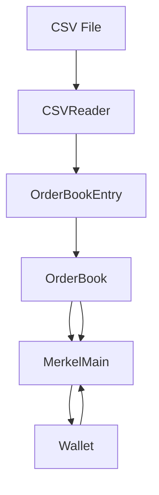

# Cryptocurrency Trading Platform - Design Document

## Table of Contents
1. [Executive Summary](#executive-summary)
2. [System Overview](#system-overview)
3. [Architecture Design](#architecture-design)
4. [Component Specifications](#component-specifications)
5. [Data Flow Design](#data-flow-design)
6. [Security Considerations](#security-considerations)
7. [Performance Analysis](#performance-analysis)
8. [Future Architecture](#future-architecture)

---

## Executive Summary

### Project Vision
The Cryptocurrency Trading Platform is a console-based simulation system designed to provide users with a realistic trading experience using historical market data. The platform emphasizes educational value and algorithmic trading concepts while maintaining a clean, modular architecture.

### Key Design Principles
- **Modularity**: Each component has a single, well-defined responsibility
- **Extensibility**: Easy to add new features and trading instruments
- **Reliability**: Robust error handling and data validation
- **Performance**: Efficient order matching and data processing
- **Maintainability**: Clear code structure and comprehensive documentation

---

## System Overview

### High-Level Architecture

```
┌─────────────────┐    ┌─────────────────┐    ┌─────────────────┐
│   User Interface│    │  Core Trading   │    │   Data Layer    │
│   (MerkelMain)  │◄──►│    Engine       │◄──►│   (CSVReader)   │
│                 │    │  (OrderBook)    │    │                 │
└─────────────────┘    └─────────────────┘    └─────────────────┘
         │                       │                       │
         ▼                       ▼                       ▼
┌─────────────────┐    ┌─────────────────┐    ┌─────────────────┐
│     Wallet      │    │ OrderBookEntry  │    │   File System   │
│   Management    │    │   (Data Model)  │    │      (CSV)      │
└─────────────────┘    └─────────────────┘    └─────────────────┘
```

### System Components
- **Presentation Layer**: User interface and interaction management
- **Business Logic Layer**: Trading rules, validation, and order processing
- **Data Access Layer**: File I/O and data parsing
- **Domain Models**: Core business entities and relationships

---

## Architecture Design

### 1. Layered Architecture Pattern

#### Presentation Layer
- **Component**: `MerkelMain`
- **Responsibility**: User interaction, menu system, input validation
- **Dependencies**: Business Logic Layer

#### Business Logic Layer
- **Components**: `OrderBook`, `Wallet`
- **Responsibility**: Trading algorithms, wallet management, business rules
- **Dependencies**: Data Models, Data Access Layer

#### Data Access Layer
- **Component**: `CSVReader`
- **Responsibility**: File parsing, data transformation
- **Dependencies**: File System

#### Data Model Layer
- **Component**: `OrderBookEntry`
- **Responsibility**: Core business entities
- **Dependencies**: Standard Library

### 2. Design Patterns Implementation

#### Strategy Pattern
```cpp
// Function pointer map for menu actions
std::map<int, void(MerkelMain::*)()> menu;
```

#### Factory Pattern (Implicit)
```cpp
static OrderBookEntry stringsToOBE(/* parameters */);
static OrderBookType stringToOrderBookType(string s);
```

#### Observer Pattern (Future Enhancement)
- Wallet balance notifications
- Order status updates
- Market event broadcasting

---

## Component Specifications

### 1. MerkelMain (Controller)

#### Responsibilities
- Application lifecycle management
- User interface presentation
- Input/output handling
- Workflow coordination

#### Key Methods
```cpp
void init()                           // Application initialization
void printMenu()                      // UI presentation
void processUserOption(int option)   // Command dispatch
void enterAsk() / enterBid()         // Order placement
void gotoNextTimeframe()             // Time progression
```

#### Design Decisions
- **Menu-driven interface**: Simple, intuitive user experience
- **Function pointer map**: Efficient command dispatch
- **Input validation**: Robust error handling
- **Separation of concerns**: Clear distinction between UI and business logic

### 2. OrderBook (Core Trading Engine)

#### Responsibilities
- Order storage and management
- Order matching algorithm
- Market data analysis
- Time-based order processing

#### Key Algorithms

##### Order Matching Algorithm
```
For each ask order (sorted by price ascending):
  For each bid order (sorted by price descending):
    If bid.price >= ask.price:
      Create sale transaction
      Determine transaction amount
      Update remaining order quantities
      Continue until orders are fulfilled
```

##### Matching Rules
1. **Price Priority**: Best prices get matched first
2. **Time Priority**: Earlier orders at same price get priority
3. **Partial Fills**: Large orders can be split across multiple matches
4. **User Attribution**: Tracks which user benefits from each trade

#### Performance Characteristics
- **Time Complexity**: O(n²) for matching in worst case
- **Space Complexity**: O(n) for order storage
- **Optimization Opportunities**: Binary search trees, priority queues

### 3. Wallet (Financial Management)

#### Responsibilities
- Multi-currency balance tracking
- Transaction validation
- Order fulfillment verification
- Balance updates

#### Key Features
```cpp
class Wallet {
private:
    std::map<std::string, double> currencies;  // Currency -> Balance mapping
    
public:
    void insertCurrency(string type, double amount);
    bool removeCurrency(string type, double amount);
    bool containsCurrency(string type, double amount);
    bool canFulfillOrder(OrderBookEntry order);
    void processSale(OrderBookEntry& sale);
};
```

#### Financial Logic
- **Ask Orders**: Require base currency (e.g., ETH for ETH/BTC)
- **Bid Orders**: Require quote currency (e.g., BTC for ETH/BTC)
- **Transaction Processing**: Atomic updates for both currencies
- **Balance Validation**: Prevent negative balances

### 4. OrderBookEntry (Data Model)

#### Data Structure
```cpp
class OrderBookEntry {
private:
    double price;                    // Order price
    double amount;                   // Order quantity
    string timestamp;                // Time of order
    string product;                  // Trading pair (e.g., ETH/BTC)
    OrderBookType orderType;         // bid, ask, bidsale, asksale
    string username;                 // Order owner
};
```

#### Order Types
- **bid**: Buy order waiting to be filled
- **ask**: Sell order waiting to be filled  
- **bidsale**: Completed buy transaction
- **asksale**: Completed sell transaction

#### Utility Functions
```cpp
static bool compareByTimestamp(const OrderBookEntry& e1, const OrderBookEntry& e2);
static bool compareByPriceAsc(const OrderBookEntry& e1, const OrderBookEntry& e2);
static bool compareByPriceDesc(const OrderBookEntry& e1, const OrderBookEntry& e2);
```

### 5. CSVReader (Data Access)

#### Responsibilities
- CSV file parsing
- String tokenization
- Data type conversion
- Error handling for malformed data

#### Parsing Algorithm
```cpp
std::vector<std::string> tokenise(std::string csvLine, char separator) {
    // Find field boundaries
    // Extract substrings
    // Handle edge cases (empty fields, quotes)
    // Return token vector
}
```

#### Error Handling
- **File Access**: Check file exists and is readable
- **Format Validation**: Verify expected number of fields
- **Type Conversion**: Handle invalid numeric values
- **Data Integrity**: Skip malformed records, continue processing

---

## Data Flow Design

### 1. Application Startup Flow

```
main() 
  → MerkelMain::init()
    → OrderBook constructor loads CSV data
    → CSVReader::readCSV() parses file
    → Wallet initialized with starting balance
    → Menu system activated
```

### 2. Order Placement Flow

```
User Input
  → MerkelMain::enterAsk() or enterBid()
    → Input validation and parsing
    → CSVReader::stringsToOBE() creates order
    → Wallet::canFulfillOrder() validates balance
    → OrderBook::insertOrder() adds to order book
    → Orders sorted by timestamp
```

### 3. Trade Execution Flow

```
MerkelMain::gotoNextTimeframe()
  → For each trading product:
    → OrderBook::matchAsksToBids()
      → Retrieve and sort orders
      → Execute matching algorithm
      → Generate sale transactions
    → MerkelMain::processSales()
      → Update wallet balances
      → Log transaction details
  → Advance to next timestamp
```

### 4. Data Dependencies



---

## Security Considerations

### Current Implementation
1. **Input Validation**: All user inputs are validated for format and type
2. **Balance Protection**: Wallet prevents negative balances
3. **Exception Handling**: Graceful error recovery
4. **Data Integrity**: Order matching preserves conservation of currency

### Security Gaps (Future Improvements)
1. **Authentication**: No user authentication system
2. **Authorization**: No access control mechanisms  
3. **Audit Trail**: Limited transaction logging
4. **Data Encryption**: Plain text data storage
5. **Rate Limiting**: No protection against rapid order placement

### Recommended Enhancements
- Implement user authentication and session management
- Add comprehensive audit logging
- Encrypt sensitive data (future database storage)
- Implement rate limiting for order placement
- Add input sanitization for SQL injection prevention

---

## Performance Analysis

### Current Performance Characteristics

#### Time Complexities
- **Order Insertion**: O(n log n) due to sorting
- **Order Matching**: O(n²) in worst case
- **Balance Lookup**: O(log k) where k = number of currencies
- **CSV Parsing**: O(m) where m = file size

#### Space Complexities
- **Order Storage**: O(n) where n = number of orders
- **Wallet Storage**: O(k) where k = number of currencies
- **Product Indexing**: O(p) where p = number of products

#### Bottlenecks Identified
1. **Order Matching Algorithm**: Quadratic complexity for large order books
2. **File I/O**: Single-threaded CSV processing
3. **Memory Usage**: All orders kept in memory simultaneously
4. **Sorting Overhead**: Frequent re-sorting of order lists

### Optimization Strategies

#### Short-term Improvements
```cpp
// Use more efficient data structures
std::priority_queue<OrderBookEntry> askQueue;  // Min-heap for asks
std::priority_queue<OrderBookEntry> bidQueue;  // Max-heap for bids

// Index orders by product and timestamp
std::map<std::string, std::map<std::string, std::vector<OrderBookEntry>>> productIndex;
```

#### Long-term Architecture
- **Database Integration**: Replace CSV with SQL database
- **Caching Strategy**: LRU cache for frequently accessed data
- **Parallel Processing**: Multi-threaded order matching
- **Memory Management**: Streaming data processing for large datasets

---

## Future Architecture

### Scalability Roadmap

#### Phase 1: Database Integration
```cpp
class DatabaseManager {
public:
    std::vector<OrderBookEntry> getOrders(const OrderQuery& query);
    void insertOrder(const OrderBookEntry& order);
    void updateWallet(const std::string& user, const WalletUpdate& update);
};
```

#### Phase 2: Multi-user Support
```cpp
class UserManager {
public:
    bool authenticateUser(const std::string& username, const std::string& password);
    Wallet& getUserWallet(const std::string& username);
    void createUser(const UserProfile& profile);
};
```

#### Phase 3: Real-time Data
```cpp
class MarketDataFeed {
public:
    void subscribeToProduct(const std::string& product, MarketDataCallback callback);
    void publishPriceUpdate(const PriceUpdate& update);
};
```

#### Phase 4: Advanced Trading Features
```cpp
enum class AdvancedOrderType {
    STOP_LOSS,
    TAKE_PROFIT,
    TRAILING_STOP,
    ICEBERG,
    TIME_IN_FORCE
};

class AdvancedOrderManager {
public:
    void placeStopLoss(const StopLossOrder& order);
    void manageIcebergOrder(const IcebergOrder& order);
    void processConditionalOrders();
};
```

### Technology Stack Evolution

#### Current Stack
- **Language**: C++11
- **Build System**: Make
- **Data Storage**: CSV files
- **Interface**: Console

#### Future Stack Options
- **Language**: C++17/20 (modern features)
- **Build System**: CMake (cross-platform)
- **Database**: PostgreSQL or MongoDB
- **Interface**: Web-based (React + REST API)
- **Message Queue**: Redis or RabbitMQ
- **Monitoring**: Prometheus + Grafana

### Microservices Architecture

```
┌─────────────────┐    ┌─────────────────┐    ┌─────────────────┐
│   Web Frontend  │    │   API Gateway   │    │  User Service   │
│    (React)      │◄──►│     (nginx)     │◄──►│  (Authentication│
└─────────────────┘    └─────────────────┘    └─────────────────┘
                                │
                                ▼
┌─────────────────┐    ┌─────────────────┐    ┌─────────────────┐
│ Trading Service │◄──►│  Order Service  │◄──►│ Wallet Service  │
│   (Matching)    │    │   (Management)  │    │   (Balances)    │
└─────────────────┘    └─────────────────┘    └─────────────────┘
         │                       │                       │
         ▼                       ▼                       ▼
┌─────────────────┐    ┌─────────────────┐    ┌─────────────────┐
│   Market Data   │    │    Database     │    │   Notification  │
│    Service      │    │   (PostgreSQL)  │    │    Service      │
└─────────────────┘    └─────────────────┘    └─────────────────┘
```

---

## Conclusion

The Cryptocurrency Trading Platform demonstrates solid software engineering principles through its modular design, clear separation of concerns, and robust error handling. The current architecture provides a strong foundation for future enhancements while maintaining simplicity and educational value.

### Key Strengths
- **Clean Architecture**: Well-defined component boundaries
- **Extensible Design**: Easy to add new features
- **Robust Implementation**: Comprehensive error handling
- **Educational Value**: Clear demonstration of trading concepts

### Areas for Improvement
- **Performance Optimization**: More efficient algorithms and data structures
- **Security Enhancement**: Authentication and authorization systems
- **User Experience**: Modern interface and better usability
- **Scalability**: Support for concurrent users and real-time data

This design document serves as a blueprint for both understanding the current system and planning future developments in the cryptocurrency trading platform.